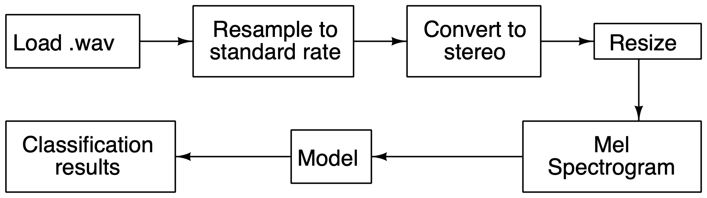

# Respiratory Sound Classification

The objective of this project is to explore different feature extraction techniques and classification models to improve the current state-of-the-art. The dataset used is the dataset given by IEEE BioCAS 2022 Grand challenge collected from from the Shanghai Children’s Medical Center (SCMC), targeting children ranging from 1 month to 18 years old.

## Training and testing flows

We have implemented the following flow for training and testing our models.

### Training flow


### Testing flow


## Directory structure
```
.
├── README.md
├── checkpoint
│   ├── checkpoint_20_1_1.pt
│   ├── checkpoint_20_1_2.pt
│   ├── checkpoint_20_2_1.pt
│   └── checkpoint_20_2_2.pt
├── figures
│   ├── model_1_1.png
│   ├── model_1_2.png
│   ├── model_2_1.png
│   ├── model_2_2.png
│   ├── test_flow.eps
│   ├── test_flow.jpg
│   ├── train_flow.eps
│   └── train_flow.jpg
├── main.py
└── models
    ├── model_1_1.py
    ├── model_1_2.py
    ├── model_2_1.py
    └── model_2_2.py
```

- `checkpoint` - Contains the saved checkpoints after 20th epoch for the models for each task
- `figures` - Figures used in this README
- `models` - Model definition files

## Run command

```
python main.py --task task_level --wav wav_path --in input_json --out output_json
```

## Preprocessing Techniques
We are first loading the given .wav audio files. Resampling can be performed if required to standardize the sampling rate. Since the dataset is sampled at the standard sampling rate of 22050, we have retained the same sampling rate throughout. The audio can also be resized to the same length through truncation or padding to standardize the lengths. However, to preserve the features of the different segments we have avoided resizing. The audio data can be augmented using time shifts. Mel spectrograms are generated from the audio data and used as input to the model. Spectrograms are used as they are capable of presenting audio data in terms of time, frequency and intensity. They can be directly used int he form of an image. Mel spectrograms use the Mel scale which models human hearing by highlighting certain frequencies better than others. Sounds of equal distance on Mel scale are perceived to be of equal distance to humans. The spectrogram data can be further augmented to produce using techniques such as time masking and frequency masking. This will help imrpove the performance and outcome of the model. Time masking is done by blocking out a range of time using vertical bars. Frequency masking is done by blocking out a range of frequency using horizontal bars. These spectrograms are then fed as inputs to models.

## Dependencies

The following libraries have been used in this project

- os
- sys
- librosa
- numpy
- torch
- cv2
- json
- matplotlib
- torchviz


## Model architecture

A Convolutional Neural Network(CNN) is used to classify the spectrograms. The CNN consists of 15 2D convolution layers with batch normalization and leaky ReLU activation followed by a flattening later and a dense layer. The convolution layers extract and highlight the features from the spectrograms while the dense layer performs the final classification. Batch normalization contributes to regularizing the neural network improving the efficieny of the model. Rectified Linear Unit(ReLU) is used the activation function as it offers advantages such as cheaper computation, faster convergence and sparse activation as compared to other activation functions. LeakyReLU is a modified version of ReLU that fixes the problem of vanishing gradient.

The model architectures for the different tasks are as shown below.

### Task 1-1


```
Classifier1_1(
    (image_classifier): Sequential(
      (0): Conv2d(
        (conv_block): Sequential(
          (0): Conv2d(3, 3, kernel_size=(3, 3), stride=(3, 3), padding=(1, 1))
          (1): BatchNorm2d(3, eps=1e-05, momentum=0.1, affine=True, track_running_stats=True)
        )
        (act): LeakyReLU(negative_slope=0.01)
      )
      (1): Conv2d(
        (conv_block): Sequential(
          (0): Conv2d(3, 3, kernel_size=(3, 3), stride=(1, 1), padding=(1, 1))
          (1): BatchNorm2d(3, eps=1e-05, momentum=0.1, affine=True, track_running_stats=True)
        )
        (act): LeakyReLU(negative_slope=0.01)
      )
      (2): Conv2d(
        (conv_block): Sequential(
          (0): Conv2d(3, 3, kernel_size=(3, 3), stride=(1, 1), padding=(1, 1))
          (1): BatchNorm2d(3, eps=1e-05, momentum=0.1, affine=True, track_running_stats=True)
        )
        (act): LeakyReLU(negative_slope=0.01)
      )
      (3): Conv2d(
        (conv_block): Sequential(
          (0): Conv2d(3, 3, kernel_size=(3, 3), stride=(3, 3), padding=(1, 1))
          (1): BatchNorm2d(3, eps=1e-05, momentum=0.1, affine=True, track_running_stats=True)
        )
        (act): LeakyReLU(negative_slope=0.01)
      )
      (4): Conv2d(
        (conv_block): Sequential(
          (0): Conv2d(3, 3, kernel_size=(3, 3), stride=(1, 1), padding=(1, 1))
          (1): BatchNorm2d(3, eps=1e-05, momentum=0.1, affine=True, track_running_stats=True)
        )
        (act): LeakyReLU(negative_slope=0.01)
      )
      (5): Conv2d(
        (conv_block): Sequential(
          (0): Conv2d(3, 3, kernel_size=(3, 3), stride=(1, 1), padding=(1, 1))
          (1): BatchNorm2d(3, eps=1e-05, momentum=0.1, affine=True, track_running_stats=True)
        )
        (act): LeakyReLU(negative_slope=0.01)
      )
      (6): Conv2d(
        (conv_block): Sequential(
          (0): Conv2d(3, 5, kernel_size=(3, 3), stride=(3, 3), padding=(1, 1))
          (1): BatchNorm2d(5, eps=1e-05, momentum=0.1, affine=True, track_running_stats=True)
        )
        (act): LeakyReLU(negative_slope=0.01)
      )
      (7): Conv2d(
        (conv_block): Sequential(
          (0): Conv2d(5, 5, kernel_size=(3, 3), stride=(1, 1), padding=(1, 1))
          (1): BatchNorm2d(5, eps=1e-05, momentum=0.1, affine=True, track_running_stats=True)
        )
        (act): LeakyReLU(negative_slope=0.01)
      )
      (8): Conv2d(
        (conv_block): Sequential(
          (0): Conv2d(5, 5, kernel_size=(3, 3), stride=(1, 1), padding=(1, 1))
          (1): BatchNorm2d(5, eps=1e-05, momentum=0.1, affine=True, track_running_stats=True)
        )
        (act): LeakyReLU(negative_slope=0.01)
      )
      (9): Conv2d(
        (conv_block): Sequential(
          (0): Conv2d(5, 5, kernel_size=(3, 3), stride=(3, 3), padding=(1, 1))
          (1): BatchNorm2d(5, eps=1e-05, momentum=0.1, affine=True, track_running_stats=True)
        )
        (act): LeakyReLU(negative_slope=0.01)
      )
      (10): Conv2d(
        (conv_block): Sequential(
          (0): Conv2d(5, 5, kernel_size=(3, 3), stride=(1, 1), padding=(1, 1))
          (1): BatchNorm2d(5, eps=1e-05, momentum=0.1, affine=True, track_running_stats=True)
        )
        (act): LeakyReLU(negative_slope=0.01)
      )
      (11): Conv2d(
        (conv_block): Sequential(
          (0): Conv2d(5, 5, kernel_size=(3, 3), stride=(1, 1), padding=(1, 1))
          (1): BatchNorm2d(5, eps=1e-05, momentum=0.1, affine=True, track_running_stats=True)
        )
        (act): LeakyReLU(negative_slope=0.01)
      )
      (12): Conv2d(
        (conv_block): Sequential(
          (0): Conv2d(5, 7, kernel_size=(3, 3), stride=(3, 3), padding=(1, 1))
          (1): BatchNorm2d(7, eps=1e-05, momentum=0.1, affine=True, track_running_stats=True)
        )
        (act): LeakyReLU(negative_slope=0.01)
      )
      (13): Conv2d(
        (conv_block): Sequential(
          (0): Conv2d(7, 7, kernel_size=(3, 3), stride=(1, 1), padding=(1, 1))
          (1): BatchNorm2d(7, eps=1e-05, momentum=0.1, affine=True, track_running_stats=True)
        )
        (act): LeakyReLU(negative_slope=0.01)
      )
      (14): Conv2d(
        (conv_block): Sequential(
          (0): Conv2d(7, 7, kernel_size=(3, 3), stride=(1, 1), padding=(1, 1))
          (1): BatchNorm2d(7, eps=1e-05, momentum=0.1, affine=True, track_running_stats=True)
        )
        (act): LeakyReLU(negative_slope=0.01)
      )
      (15): Flatten(start_dim=1, end_dim=-1)
      (16): Dense(
        (dense_layer): Linear(in_features=7, out_features=2, bias=True)
        (act): Softmax(dim=1)
      )
    )
  )
```

### Task 1-2


```
Classifier1_2(
    (image_classifier): Sequential(
      (0): Conv2d(
        (conv_block): Sequential(
          (0): Conv2d(3, 3, kernel_size=(3, 3), stride=(3, 3), padding=(1, 1))
          (1): BatchNorm2d(3, eps=1e-05, momentum=0.1, affine=True, track_running_stats=True)
        )
        (act): LeakyReLU(negative_slope=0.01)
      )
      (1): Conv2d(
        (conv_block): Sequential(
          (0): Conv2d(3, 3, kernel_size=(3, 3), stride=(1, 1), padding=(1, 1))
          (1): BatchNorm2d(3, eps=1e-05, momentum=0.1, affine=True, track_running_stats=True)
        )
        (act): LeakyReLU(negative_slope=0.01)
      )
      (2): Conv2d(
        (conv_block): Sequential(
          (0): Conv2d(3, 3, kernel_size=(3, 3), stride=(1, 1), padding=(1, 1))
          (1): BatchNorm2d(3, eps=1e-05, momentum=0.1, affine=True, track_running_stats=True)
        )
        (act): LeakyReLU(negative_slope=0.01)
      )
      (3): Conv2d(
        (conv_block): Sequential(
          (0): Conv2d(3, 3, kernel_size=(3, 3), stride=(3, 3), padding=(1, 1))
          (1): BatchNorm2d(3, eps=1e-05, momentum=0.1, affine=True, track_running_stats=True)
        )
        (act): LeakyReLU(negative_slope=0.01)
      )
      (4): Conv2d(
        (conv_block): Sequential(
          (0): Conv2d(3, 3, kernel_size=(3, 3), stride=(1, 1), padding=(1, 1))
          (1): BatchNorm2d(3, eps=1e-05, momentum=0.1, affine=True, track_running_stats=True)
        )
        (act): LeakyReLU(negative_slope=0.01)
      )
      (5): Conv2d(
        (conv_block): Sequential(
          (0): Conv2d(3, 3, kernel_size=(3, 3), stride=(1, 1), padding=(1, 1))
          (1): BatchNorm2d(3, eps=1e-05, momentum=0.1, affine=True, track_running_stats=True)
        )
        (act): LeakyReLU(negative_slope=0.01)
      )
      (6): Conv2d(
        (conv_block): Sequential(
          (0): Conv2d(3, 5, kernel_size=(3, 3), stride=(3, 3), padding=(1, 1))
          (1): BatchNorm2d(5, eps=1e-05, momentum=0.1, affine=True, track_running_stats=True)
        )
        (act): LeakyReLU(negative_slope=0.01)
      )
      (7): Conv2d(
        (conv_block): Sequential(
          (0): Conv2d(5, 5, kernel_size=(3, 3), stride=(1, 1), padding=(1, 1))
          (1): BatchNorm2d(5, eps=1e-05, momentum=0.1, affine=True, track_running_stats=True)
        )
        (act): LeakyReLU(negative_slope=0.01)
      )
      (8): Conv2d(
        (conv_block): Sequential(
          (0): Conv2d(5, 5, kernel_size=(3, 3), stride=(1, 1), padding=(1, 1))
          (1): BatchNorm2d(5, eps=1e-05, momentum=0.1, affine=True, track_running_stats=True)
        )
        (act): LeakyReLU(negative_slope=0.01)
      )
      (9): Conv2d(
        (conv_block): Sequential(
          (0): Conv2d(5, 5, kernel_size=(3, 3), stride=(3, 3), padding=(1, 1))
          (1): BatchNorm2d(5, eps=1e-05, momentum=0.1, affine=True, track_running_stats=True)
        )
        (act): LeakyReLU(negative_slope=0.01)
      )
      (10): Conv2d(
        (conv_block): Sequential(
          (0): Conv2d(5, 5, kernel_size=(3, 3), stride=(1, 1), padding=(1, 1))
          (1): BatchNorm2d(5, eps=1e-05, momentum=0.1, affine=True, track_running_stats=True)
        )
        (act): LeakyReLU(negative_slope=0.01)
      )
      (11): Conv2d(
        (conv_block): Sequential(
          (0): Conv2d(5, 5, kernel_size=(3, 3), stride=(1, 1), padding=(1, 1))
          (1): BatchNorm2d(5, eps=1e-05, momentum=0.1, affine=True, track_running_stats=True)
        )
        (act): LeakyReLU(negative_slope=0.01)
      )
      (12): Conv2d(
        (conv_block): Sequential(
          (0): Conv2d(5, 7, kernel_size=(3, 3), stride=(3, 3), padding=(1, 1))
          (1): BatchNorm2d(7, eps=1e-05, momentum=0.1, affine=True, track_running_stats=True)
        )
        (act): LeakyReLU(negative_slope=0.01)
      )
      (13): Conv2d(
        (conv_block): Sequential(
          (0): Conv2d(7, 7, kernel_size=(3, 3), stride=(1, 1), padding=(1, 1))
          (1): BatchNorm2d(7, eps=1e-05, momentum=0.1, affine=True, track_running_stats=True)
        )
        (act): LeakyReLU(negative_slope=0.01)
      )
      (14): Conv2d(
        (conv_block): Sequential(
          (0): Conv2d(7, 7, kernel_size=(3, 3), stride=(1, 1), padding=(1, 1))
          (1): BatchNorm2d(7, eps=1e-05, momentum=0.1, affine=True, track_running_stats=True)
        )
        (act): LeakyReLU(negative_slope=0.01)
      )
      (15): Flatten(start_dim=1, end_dim=-1)
      (16): Dense(
        (dense_layer): Linear(in_features=7, out_features=7, bias=True)
        (act): Softmax(dim=1)
      )
    )
  )
```

### Task 2-1


```
Classifier1_2(
    (image_classifier): Sequential(
      (0): Conv2d(
        (conv_block): Sequential(
          (0): Conv2d(3, 3, kernel_size=(3, 3), stride=(3, 3), padding=(1, 1))
          (1): BatchNorm2d(3, eps=1e-05, momentum=0.1, affine=True, track_running_stats=True)
        )
        (act): LeakyReLU(negative_slope=0.01)
      )
      (1): Conv2d(
        (conv_block): Sequential(
          (0): Conv2d(3, 3, kernel_size=(3, 3), stride=(1, 1), padding=(1, 1))
          (1): BatchNorm2d(3, eps=1e-05, momentum=0.1, affine=True, track_running_stats=True)
        )
        (act): LeakyReLU(negative_slope=0.01)
      )
      (2): Conv2d(
        (conv_block): Sequential(
          (0): Conv2d(3, 3, kernel_size=(3, 3), stride=(1, 1), padding=(1, 1))
          (1): BatchNorm2d(3, eps=1e-05, momentum=0.1, affine=True, track_running_stats=True)
        )
        (act): LeakyReLU(negative_slope=0.01)
      )
      (3): Conv2d(
        (conv_block): Sequential(
          (0): Conv2d(3, 3, kernel_size=(3, 3), stride=(3, 3), padding=(1, 1))
          (1): BatchNorm2d(3, eps=1e-05, momentum=0.1, affine=True, track_running_stats=True)
        )
        (act): LeakyReLU(negative_slope=0.01)
      )
      (4): Conv2d(
        (conv_block): Sequential(
          (0): Conv2d(3, 3, kernel_size=(3, 3), stride=(1, 1), padding=(1, 1))
          (1): BatchNorm2d(3, eps=1e-05, momentum=0.1, affine=True, track_running_stats=True)
        )
        (act): LeakyReLU(negative_slope=0.01)
      )
      (5): Conv2d(
        (conv_block): Sequential(
          (0): Conv2d(3, 3, kernel_size=(3, 3), stride=(1, 1), padding=(1, 1))
          (1): BatchNorm2d(3, eps=1e-05, momentum=0.1, affine=True, track_running_stats=True)
        )
        (act): LeakyReLU(negative_slope=0.01)
      )
      (6): Conv2d(
        (conv_block): Sequential(
          (0): Conv2d(3, 5, kernel_size=(3, 3), stride=(3, 3), padding=(1, 1))
          (1): BatchNorm2d(5, eps=1e-05, momentum=0.1, affine=True, track_running_stats=True)
        )
        (act): LeakyReLU(negative_slope=0.01)
      )
      (7): Conv2d(
        (conv_block): Sequential(
          (0): Conv2d(5, 5, kernel_size=(3, 3), stride=(1, 1), padding=(1, 1))
          (1): BatchNorm2d(5, eps=1e-05, momentum=0.1, affine=True, track_running_stats=True)
        )
        (act): LeakyReLU(negative_slope=0.01)
      )
      (8): Conv2d(
        (conv_block): Sequential(
          (0): Conv2d(5, 5, kernel_size=(3, 3), stride=(1, 1), padding=(1, 1))
          (1): BatchNorm2d(5, eps=1e-05, momentum=0.1, affine=True, track_running_stats=True)
        )
        (act): LeakyReLU(negative_slope=0.01)
      )
      (9): Conv2d(
        (conv_block): Sequential(
          (0): Conv2d(5, 5, kernel_size=(3, 3), stride=(3, 3), padding=(1, 1))
          (1): BatchNorm2d(5, eps=1e-05, momentum=0.1, affine=True, track_running_stats=True)
        )
        (act): LeakyReLU(negative_slope=0.01)
      )
      (10): Conv2d(
        (conv_block): Sequential(
          (0): Conv2d(5, 5, kernel_size=(3, 3), stride=(1, 1), padding=(1, 1))
          (1): BatchNorm2d(5, eps=1e-05, momentum=0.1, affine=True, track_running_stats=True)
        )
        (act): LeakyReLU(negative_slope=0.01)
      )
      (11): Conv2d(
        (conv_block): Sequential(
          (0): Conv2d(5, 5, kernel_size=(3, 3), stride=(1, 1), padding=(1, 1))
          (1): BatchNorm2d(5, eps=1e-05, momentum=0.1, affine=True, track_running_stats=True)
        )
        (act): LeakyReLU(negative_slope=0.01)
      )
      (12): Conv2d(
        (conv_block): Sequential(
          (0): Conv2d(5, 7, kernel_size=(3, 3), stride=(3, 3), padding=(1, 1))
          (1): BatchNorm2d(7, eps=1e-05, momentum=0.1, affine=True, track_running_stats=True)
        )
        (act): LeakyReLU(negative_slope=0.01)
      )
      (13): Conv2d(
        (conv_block): Sequential(
          (0): Conv2d(7, 7, kernel_size=(3, 3), stride=(1, 1), padding=(1, 1))
          (1): BatchNorm2d(7, eps=1e-05, momentum=0.1, affine=True, track_running_stats=True)
        )
        (act): LeakyReLU(negative_slope=0.01)
      )
      (14): Conv2d(
        (conv_block): Sequential(
          (0): Conv2d(7, 7, kernel_size=(3, 3), stride=(1, 1), padding=(1, 1))
          (1): BatchNorm2d(7, eps=1e-05, momentum=0.1, affine=True, track_running_stats=True)
        )
        (act): LeakyReLU(negative_slope=0.01)
      )
      (15): Flatten(start_dim=1, end_dim=-1)
      (16): Dense(
        (dense_layer): Linear(in_features=7, out_features=3, bias=True)
        (act): Softmax(dim=1)
      )
    )
  )
```

### Task 2-2


```
Classifier1_2(
    (image_classifier): Sequential(
      (0): Conv2d(
        (conv_block): Sequential(
          (0): Conv2d(3, 3, kernel_size=(3, 3), stride=(3, 3), padding=(1, 1))
          (1): BatchNorm2d(3, eps=1e-05, momentum=0.1, affine=True, track_running_stats=True)
        )
        (act): LeakyReLU(negative_slope=0.01)
      )
      (1): Conv2d(
        (conv_block): Sequential(
          (0): Conv2d(3, 3, kernel_size=(3, 3), stride=(1, 1), padding=(1, 1))
          (1): BatchNorm2d(3, eps=1e-05, momentum=0.1, affine=True, track_running_stats=True)
        )
        (act): LeakyReLU(negative_slope=0.01)
      )
      (2): Conv2d(
        (conv_block): Sequential(
          (0): Conv2d(3, 3, kernel_size=(3, 3), stride=(1, 1), padding=(1, 1))
          (1): BatchNorm2d(3, eps=1e-05, momentum=0.1, affine=True, track_running_stats=True)
        )
        (act): LeakyReLU(negative_slope=0.01)
      )
      (3): Conv2d(
        (conv_block): Sequential(
          (0): Conv2d(3, 3, kernel_size=(3, 3), stride=(3, 3), padding=(1, 1))
          (1): BatchNorm2d(3, eps=1e-05, momentum=0.1, affine=True, track_running_stats=True)
        )
        (act): LeakyReLU(negative_slope=0.01)
      )
      (4): Conv2d(
        (conv_block): Sequential(
          (0): Conv2d(3, 3, kernel_size=(3, 3), stride=(1, 1), padding=(1, 1))
          (1): BatchNorm2d(3, eps=1e-05, momentum=0.1, affine=True, track_running_stats=True)
        )
        (act): LeakyReLU(negative_slope=0.01)
      )
      (5): Conv2d(
        (conv_block): Sequential(
          (0): Conv2d(3, 3, kernel_size=(3, 3), stride=(1, 1), padding=(1, 1))
          (1): BatchNorm2d(3, eps=1e-05, momentum=0.1, affine=True, track_running_stats=True)
        )
        (act): LeakyReLU(negative_slope=0.01)
      )
      (6): Conv2d(
        (conv_block): Sequential(
          (0): Conv2d(3, 5, kernel_size=(3, 3), stride=(3, 3), padding=(1, 1))
          (1): BatchNorm2d(5, eps=1e-05, momentum=0.1, affine=True, track_running_stats=True)
        )
        (act): LeakyReLU(negative_slope=0.01)
      )
      (7): Conv2d(
        (conv_block): Sequential(
          (0): Conv2d(5, 5, kernel_size=(3, 3), stride=(1, 1), padding=(1, 1))
          (1): BatchNorm2d(5, eps=1e-05, momentum=0.1, affine=True, track_running_stats=True)
        )
        (act): LeakyReLU(negative_slope=0.01)
      )
      (8): Conv2d(
        (conv_block): Sequential(
          (0): Conv2d(5, 5, kernel_size=(3, 3), stride=(1, 1), padding=(1, 1))
          (1): BatchNorm2d(5, eps=1e-05, momentum=0.1, affine=True, track_running_stats=True)
        )
        (act): LeakyReLU(negative_slope=0.01)
      )
      (9): Conv2d(
        (conv_block): Sequential(
          (0): Conv2d(5, 5, kernel_size=(3, 3), stride=(3, 3), padding=(1, 1))
          (1): BatchNorm2d(5, eps=1e-05, momentum=0.1, affine=True, track_running_stats=True)
        )
        (act): LeakyReLU(negative_slope=0.01)
      )
      (10): Conv2d(
        (conv_block): Sequential(
          (0): Conv2d(5, 5, kernel_size=(3, 3), stride=(1, 1), padding=(1, 1))
          (1): BatchNorm2d(5, eps=1e-05, momentum=0.1, affine=True, track_running_stats=True)
        )
        (act): LeakyReLU(negative_slope=0.01)
      )
      (11): Conv2d(
        (conv_block): Sequential(
          (0): Conv2d(5, 5, kernel_size=(3, 3), stride=(1, 1), padding=(1, 1))
          (1): BatchNorm2d(5, eps=1e-05, momentum=0.1, affine=True, track_running_stats=True)
        )
        (act): LeakyReLU(negative_slope=0.01)
      )
      (12): Conv2d(
        (conv_block): Sequential(
          (0): Conv2d(5, 7, kernel_size=(3, 3), stride=(3, 3), padding=(1, 1))
          (1): BatchNorm2d(7, eps=1e-05, momentum=0.1, affine=True, track_running_stats=True)
        )
        (act): LeakyReLU(negative_slope=0.01)
      )
      (13): Conv2d(
        (conv_block): Sequential(
          (0): Conv2d(7, 7, kernel_size=(3, 3), stride=(1, 1), padding=(1, 1))
          (1): BatchNorm2d(7, eps=1e-05, momentum=0.1, affine=True, track_running_stats=True)
        )
        (act): LeakyReLU(negative_slope=0.01)
      )
      (14): Conv2d(
        (conv_block): Sequential(
          (0): Conv2d(7, 7, kernel_size=(3, 3), stride=(1, 1), padding=(1, 1))
          (1): BatchNorm2d(7, eps=1e-05, momentum=0.1, affine=True, track_running_stats=True)
        )
        (act): LeakyReLU(negative_slope=0.01)
      )
      (15): Flatten(start_dim=1, end_dim=-1)
      (16): Dense(
        (dense_layer): Linear(in_features=7, out_features=5, bias=True)
        (act): Softmax(dim=1)
      )
    )
  )
```


